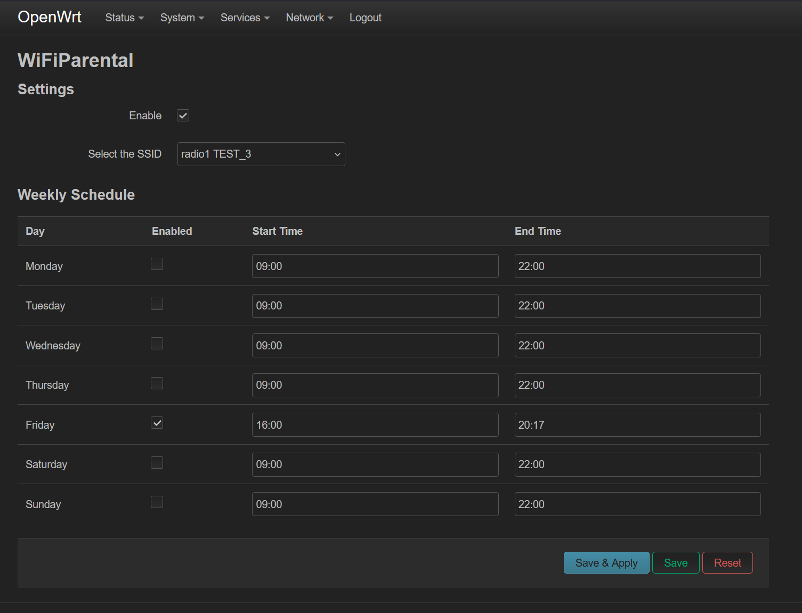
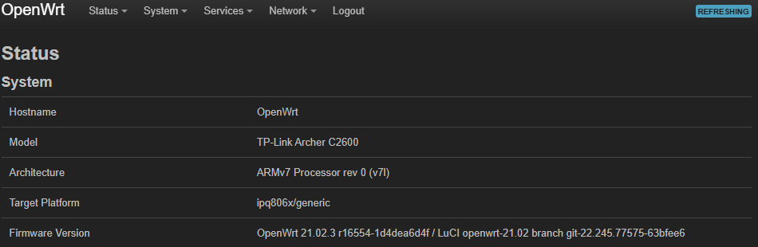
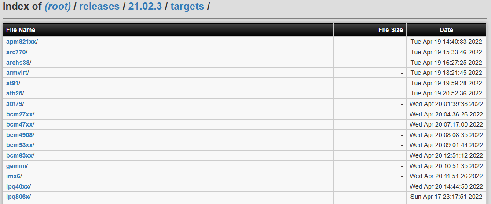
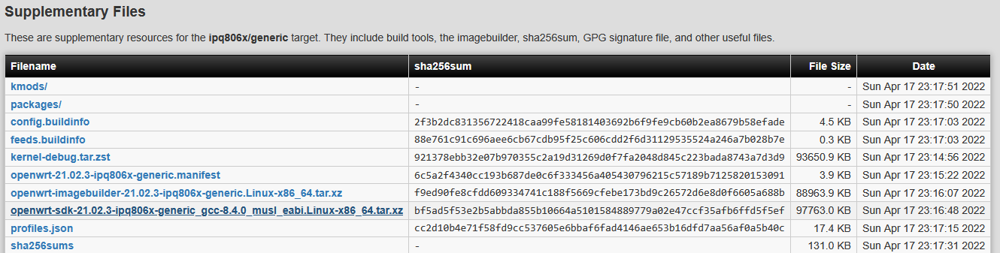

# luci-app-wifiparental

  This package allows for you to schedule the shutdown of a specific SSID on an OpenWrt instance. To configure the application to fit your needs, find the control panel under the "Services" tab of the OpenWrt web interface. Ensure that your timezone is set properly or the application will not work as expected. 

  

# Compiling

  In order to compile wifiparental, you must first obtain an OpenWrt [SDK](https://downloads.openwrt.org/) for the release you are working with.

  The release and target suited for your device are visible on the OpenWrt Status Overview page.

  

  Locate the appropriate release on the [OpenWrt SDK download page](https://downloads.openwrt.org/).

  

  Select the appropriate target.

  

  Under the supplementary files, you will find the SDK that you need.

  

  After you have the SDK downloaded, follow the steps below carefully in order to compile wifiparental.
  
  ```bash
   # Extract the SDK
   tar -xf openwrt-sdk-21.02.3-ipq806x-generic_gcc-8.4.0_musl_eabi.Linux-x86_64
   cd openwrt-*

   # Clone the repository into your source folder
   git clone git@github.com:kevinmalone33/luci-app-wifiparental.git package/luci-app-wifiparental

   # Ensure that the package is checked under LuCI -> 3. Applications -> luci-app-wifiparental
   make menuconfig V=s

   # Finally, compile the project
   make package/luci-app-wifiparental/compile V=s
   ```

  Once you have compiled, an output IPK will be present in the ``/bin/`` directory at the root of the SDK you extracted earlier. This IPK can then be installed as you would any other package, through the OpenWrt interface.

----------